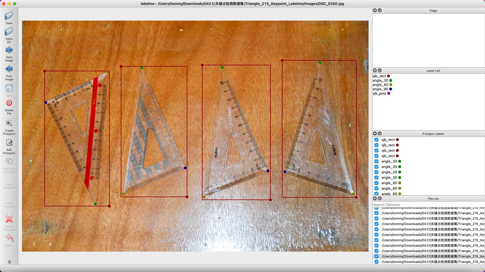
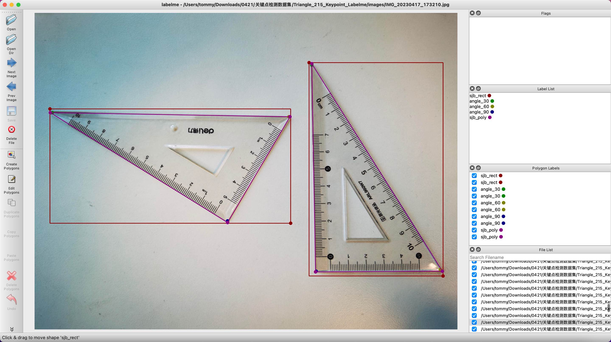

# 关键点检测数据集

同济子豪兄 2023-6-11

## 30度直角三角板关键点检测数据集

拍摄：张子豪（同济子豪兄）、田文博

标注：张子豪（同济子豪兄）

| 标注内容 | 含义                   | 标注形式       |
| -------- | ---------------------- | -------------- |
| sjb_rect | 30度直角三角板外接矩形 | 框（rect）     |
| angle_30 | 30度角点               | 点（point）    |
| angle_60 | 60度角点               | 点（point）    |
| angle_90 | 90度角点               | 点（point）    |
| sjb_poly | 30度直角三角板区域     | 多段线（poly） |

Labelme标注格式（没有划分训练集和测试集）：https://zihao-download.obs.cn-east-3.myhuaweicloud.com/yolov8/datasets/Triangle_215_Dataset/Triangle_215_Keypoint_Labelme.zip

YOLO标注格式（已划分训练集和测试集）：https://zihao-download.obs.cn-east-3.myhuaweicloud.com/yolov8/datasets/Triangle_215_Dataset/Triangle_215_Keypoint_YOLO.zip

MS COCO标注格式（已划分训练集和测试集）：https://zihao-download.obs.cn-east-3.myhuaweicloud.com/yolov8/datasets/Triangle_215_Dataset/Triangle_215_Keypoint_coco.zip

> 备注：两个标注格式的训练集和测试集不一样

## 数据集使用说明

以上数据集开源免费，注明出处即可使用。但因华为云OBS存储、上传、下载皆有成本，每次下载数据集，请自觉转5元至支付宝407431120@qq.com

## 手部、耳朵、足部、躯干、背部穴位关键点检测数据集

请联系子豪兄助理小田，微信号：T20220117
